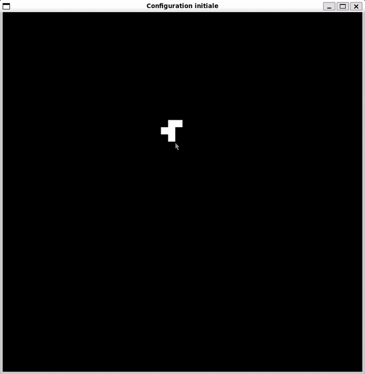

# Game Of Life
Projet réalisé dans le cadre de la licence informatique à l'Université de Toulon.\
Le travail demandé était:
* Demander à l’utilisateur la taille de la grille
* Demander combien de tours dure la partie
* Demander le nombre initial de cases occupées
* Saisir la position des cases occupées au début du jeu
* Faire jouer le nombre de tours souhaités en affichant le jeu de façon graphique

### Améliorations potentielles:
* S'intéresser à la programmation parallèle en C pour le calcul de la génération suivante
* Modifier le système de "Caméra" pour zoomer où le pointeur est
* Faire des recherches sur Valgrind pour ignorer les erreurs causées par SDL

## Exemple
\
(Le GIF est en 8fps)